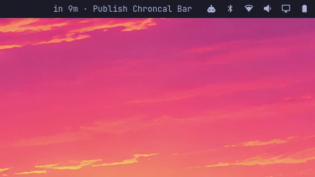

# Chroncal Bar

An [Omarchy Quattro](https://omarchy.org/) menu-bar calendar powered by [Chroncal](https://github.com/DouglasdeMoura/chroncal).



## Features

### Bar

- Shows every overlapping current event, or the next upcoming event.
- Uses relative labels near an event (`in 5m`, `12m left`) and explicit weekday labels for later events (`Mon 09:00`).
- Handles timed, all-day, overlapping, upcoming, and in-progress events.
- Uses Chroncal calendar colors in the label, agenda, and progress indicator.
- Hides itself when no visible event remains in the configured preview window.
- Hovering shows nothing. Left click opens the agenda, middle click opens the next event URL, and right click refreshes.

### Agenda panel

- Groups events under Today, Tomorrow, and later dates.
- Filters hidden calendars and supports per-calendar inclusion.
- Searches titles, descriptions, locations, calendar names, and participants.
- Shows location, notes, conferencing links, attendees, and RSVP state.
- Opens meeting links, maps, participant email, and Chroncal.
- Copies complete event details to the clipboard.
- Creates, edits, and deletes Chroncal events without shell interpolation.
- Preserves omitted fields during edits and never reinterprets unchanged event times.
- Confirms deletion before changing Chroncal data.
- Shows an enabled edit pencil for every event with a usable identity.
- Loads and edits the whole recurring series for generated occurrences.
- Edits stored recurrence overrides as that override only.
- Creates and edits recurrence with Chroncal Repeat presets and inline Custom fields.
- Leaves stored override Repeat rules on the series; open the series editor to change them.
- Deletes this event, this and following, or all events in a recurring series from the panel confirm.

This is menu-bar parity, not a replacement for Chroncal's full TUI. Timezone-sensitive time changes, alarms, availability, sync configuration, account management, and advanced calendar operations remain in Chroncal.

## Requirements

- Omarchy Quattro
- Chroncal 0.7.4 or newer on `PATH`
- `bash`, `jq`, GNU `date`, and GNU `timeout`
- `xdg-open` for links and maps
- `wl-copy` for copy actions
- `notify-send` for helper errors

Install Chroncal with mise if needed:

```sh
mise use -g github:DouglasdeMoura/chroncal@0.7.4
```

Authenticate and configure calendars in the Chroncal TUI before expecting events on the bar:

```sh
chroncal
```

## Install

```sh
omarchy plugin add https://github.com/DouglasdeMoura/chroncal-bar.git --enable
omarchy bar move douglasdemoura.chroncal-bar --section right --after omarchy.tray
```

The second command is optional. It places the widget beside the tray in the right-aligned bar group.

## Use

| Key | Context | Action |
| --- | --- | --- |
| `↑` / `↓`, `j` / `k` | Agenda | Move selection |
| `←` / `→`, `h` / `l` | Agenda | Previous or next day |
| `t` | Agenda | Jump to today's first event |
| `Enter` / `Space` | Agenda | Open selected event |
| `/` | Agenda | Open search |
| `c` | Agenda or details | Create event |
| `e` | Agenda or details | Edit event or recurring series |
| `x` or `Delete` | Agenda or details | Delete this event, this and following, or all events |
| `v` | Event details | Join or open event URL |
| `p` | Event details | Copy event details |
| `g` | Event details | Open Chroncal |
| `s` | Agenda | Refresh |
| `C` or `,` | Agenda | Open settings |
| `?` | Agenda | Open shortcut help |
| `Ctrl+S` | Event editor | Save event or series |
| `Esc` or `q` | Any panel view | Back, cancel, or close |

Search opens with `/`. Subviews share one header back arrow. Create is the agenda header action. Settings is Calendar Settings… at the bottom of the agenda. Shortcut help opens with `?`. Refresh happens when the panel opens, on `s`, and on bar right-click. Event-detail buttons cover the rest.

## Configure

Open the agenda and press `C` or `,`, or click Calendar Settings… at the bottom of the agenda. Available settings:

- Days ahead (1–30) and refresh interval.
- Maximum bar-title length and the relative-countdown window.
- Included calendars; all are selected automatically until you customize the selection.
- Show or hide time and title in the bar.
- Include or exclude all-day events.
- Include or exclude events without participants.
- Include or exclude events without a physical location or meeting link.

Calendar selection has two states. Default mode selects every current calendar and automatically includes calendars added later. The first checkbox change stores an exact custom selection; selecting none hides every event. Use **Use default (all calendars)** to discard the custom selection and return to automatic default mode.

Settings persist on the widget entry in `~/.config/omarchy/shell.json`. They can also be changed from the command line:

```sh
omarchy bar set douglasdemoura.chroncal-bar interval 60
omarchy bar set douglasdemoura.chroncal-bar lookaheadDays 7
omarchy bar set douglasdemoura.chroncal-bar showTitle On
omarchy bar set douglasdemoura.chroncal-bar relativeLeadMinutes 10
```

Force a refresh:

```sh
omarchy-shell douglasdemoura.chroncal-bar refresh
```

## Runtime and service behavior

The plugin runs inside Omarchy's long-running Quickshell process with your user permissions. Its QML timer starts a one-shot agenda helper at the configured interval; the helper emits one normalized JSON document and exits. The plugin does not start another Quickshell process, install packages, request elevated privileges, or run a remote installer.

Chroncal remains the source of truth. The plugin calls its CLI to read calendar and event data and to perform explicitly requested create, update, and delete actions. Helpers also read `~/.local/state/chroncal/state.json` for hidden calendar IDs.

Chroncal's optional `chroncal service run` process is separate. This plugin neither installs nor controls that service.

## Remove

```sh
omarchy plugin remove douglasdemoura.chroncal-bar
```

Removal deletes only the plugin. It does not remove Chroncal, calendar state, or any separate Chroncal service.

## Development

```sh
TZ=UTC bun tests/test-model.js
tests/test-agenda.sh
tests/test-open-url.sh
bash -n scripts/chroncal-exec scripts/chroncal-bar-agenda scripts/chroncal-next-event scripts/chroncal-open-next-event-url
omarchy plugin validate .
/usr/lib/qt6/bin/qmllint -I /usr/share/omarchy/shell \
  BarWidget.qml Panel.qml components/*.qml
```

`qmllint` exits successfully but reports unresolved `qs.Commons` and `qs.Ui` types outside the running Omarchy shell. Runtime smoke tests cover the real plugin host.

## License

[MIT](LICENSE)
